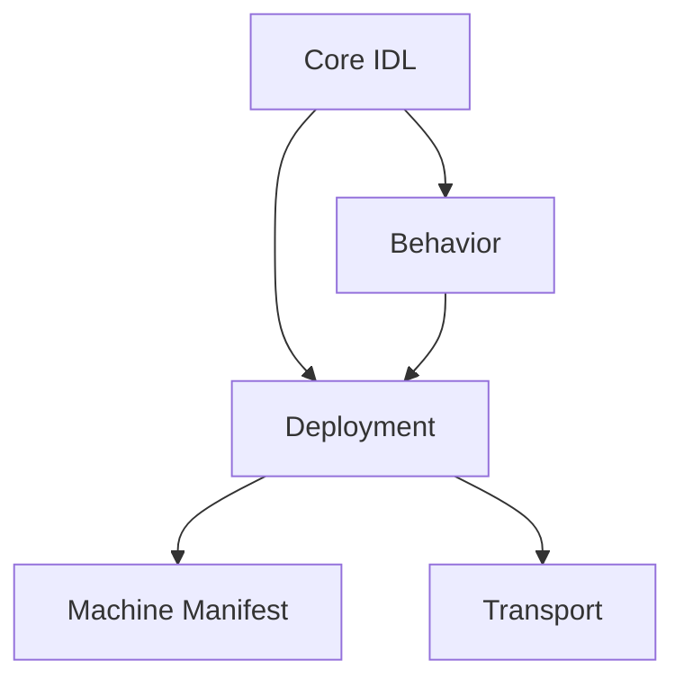

# Qorix Data-Model(qor-dm) Detailed Specification
### Unified Data Model for Application & Communication Design
*(Extending IFEX core-idl for Qorix Adaptive and Performance Middleware)*

---

## 1️ Introduction

### 1.1 Objective
This specification defines the **Qorix Data-Model extended IFEX data model**, unifying **Application Design** and **Communication Design** across middleware ecosystems — primarily **Qorix Adaptive** and **Qorix Performance**.  
It replaces complex ARXML trees with clean, layered YAML/JSON definitions.

### 1.2 Goals
- Provide a generic, extensible model for service-oriented applications and communication systems.  
- Enable **AI-assisted**, schema-aware design and validation.  
- Ensure **bidirectional compatibility** with AUTOSAR and Qorix Performance data models.  
- Support human-readable, machine-validatable formats.

### 1.3 Scope
Defines the qor-dm meta-model, including:
- Core, Machine, Transport, Deployment, and Behavior layers.  
- Validation and governance rules.  
- Middleware mappings and interoperability semantics.

---

## 2️ IFEX Layered Architecture

| Layer | Concern | Description |
|--------|----------|-------------|
| **Core IFEX IDL** | API Model | Interfaces, methods, events, datatypes |
| **Machine** | Platform Model | Devices, OS, CPUs, and networks |
| **Transport** | Protocol Model | Middleware-specific profiles (SOME/IP, DDS, gRPC) |
| **Deployment** | Runtime Model | Execution, service binding, QoS |
| **Behavior** | Logic Model | Control flows, orchestration, and scheduling |

Each layer is self-contained and **composable by name** using deterministic merge semantics.

---

## 3️ Core IDL — Interface Definition Language

### Purpose
Defines **logical API contracts** — interfaces, data types, and events — without transport or runtime dependencies.

### Entities
| Element | Description |
|----------|-------------|
| `namespace` | Logical grouping of interfaces and types |
| `interface` | Public service contract |
| `method` | RPC-style callable operation |
| `event` | Publish/subscribe message |
| `property` | Observable state |
| `typedef`, `struct`, `enumeration` | Data definitions |

### Example
```yaml
namespaces:
  - name: app
    interface:
      name: radar.v1
      version_major: 1
      methods:
        - name: get_frame
          input: [{ name: roi, datatype: Roi }]
          returns: [{ name: frame, datatype: bytes }]
      events:
        - name: fault
          input: [{ name: code, datatype: fault_t }]
    typedefs:
      - { name: Fps_t, datatype: uint16 }
    structs:
      - name: Roi
        fields:
          - { name: x, datatype: uint16 }
          - { name: y, datatype: uint16 }
```

### Constraints
- `interface.version_major` MUST match the deployment version.  
- `datatype` MUST be resolvable locally or imported.  
- No transport or address fields allowed.

---

## 4️ Machine Manifest — Platform and Network Description

### Purpose
Describes physical and logical compute topology.

### Elements
| Element | Description |
|----------|-------------|
| `network` | Defines network interfaces and address ranges |
| `machine` | Represents hardware nodes |
| `device` | Hardware units (CPU, GPU, timer, etc.) |
| `resource` | Logical resources (memory, segment, etc.) |

### Example
```yaml
machines:
  - id: carA
    os: { class: linux, distro: ubuntu-24.04, kernel: 6.8 }
    interfaces:
      - network: veh-eth0
        ipv4: 10.0.0.10
networks:
  - id: veh-eth0
    type: ethernet
    vlan: 100
    ipv4_cidr: 10.0.0.0/24
    multicast_pools: [239.10.0.0/24]
```

### Constraints
- Each `machine.network` must reference an existing `network.id`.  
- IP and multicast addresses must be unique.  
- Deployment endpoints must reference these IPs.

---

## 5️ Transport Profile — Protocol-Specific Configuration

### Purpose
Defines middleware-specific parameters such as discovery and serialization.

### Elements
| Key | Description |
|------|-------------|
| `name` | Transport name (someip, grpc, dds, ipc) |
| `sd` | Service Discovery options |
| `serialization` | Encoding (cbor, json, protobuf) |
| `defaults` | Default transport mapping |

### Example (SOME/IP)
```yaml
transports:
  - name: someip
    sd:
      enabled: true
      repetition_base_delay_ms: 200
      repetition_max: 3
      ttl_s: 3
    serialization: cbor
    defaults:
      rpc_protocol: tcp
      event_protocol: udp
```

---

## 6️ Deployment — Runtime Binding and QoS Model

### Purpose
Binds interfaces from Core IDL to machine nodes and transports.

### Structure
| Element | Description |
|----------|-------------|
| `process` | Executable component |
| `machine` | Target node |
| `service.provides` | Provided service instance |
| `transport` | Middleware binding (someip, grpc) |
| `engine` | Scheduling context |
| `timer` | Periodic trigger |

### Example
```yaml
processes:
  - name: radar-proc
    machine: carA
    network: veh-eth0
    service:
      provides:
        - interface: app.radar.v1
          instance: radar-1
          someip:
            service_id: 0x1234
            version_major: 1
            endpoints:
              rpc: { protocol: tcp, address: 10.0.0.10, port: 30490 }
              event: { protocol: udp, multicast: 239.10.0.1, port: 30500, ttl: 1 }
            methods:
              - name: get_frame
                method_id: 0x0001
                qos: { timeout_ms: 500, retries: 2 }
            events:
              - name: fault
                event_id: 0x8001
                qos: { reliability: best-effort, rate_limit_hz: 20 }
```

### QoS Parameters
| Key | Description |
|------|-------------|
| `timeout_ms` | RPC timeout |
| `retries` | Retry attempts |
| `max_payload_bytes` | Payload cap |
| `reliability` | Reliability type |
| `rate_limit_hz` | Publish frequency |

---

## 7️ Behavior — Dynamic Orchestration Layer

### Purpose
Defines runtime execution logic and control flow across services.

### Supported Actions
| Action | Description |
|---------|-------------|
| `Sequence` | Ordered execution |
| `Invoke` | Invoke method or function |
| `Sync` | Synchronize on barrier |
| `Trigger` | Emit event |
| `If` | Conditional logic |
| `Loop` | Repeated action |
| `Concurrency` | Parallel branches |

### Example
```yaml
programs:
  - name: acquire_frame
    actions:
      - type: Sequence
        steps:
          - { type: Invoke, target: driver.capture }
          - { type: Sync, barrier: sensor_ready }
          - type: If
            condition: hw_error || sw_error
            then:
              - { type: Trigger, event: app.radar.v1.fault }
            else:
              - { type: Invoke, target: processing.pipeline }
```

### Scheduling
| Field | Description |
|--------|-------------|
| `period` | Execution interval |
| `deadline` | Maximum duration |
| `budget` | CPU time allocation |
| `priority` | Execution priority |
| `engine` | Deployment engine link |

---

## 8️ Integration Rules

| Rule | Description |
|------|-------------|
| R1 | `deployment.service.interface` must resolve to Core IDL. |
| R2 | Machine/network references must exist in Machine Manifest. |
| R3 | Behavior targets must reference valid Core operations. |
| R4 | Transport types must be declared in `transports[]`. |
| R5 | Event multicast addresses must fall within allowed pools. |
| R6 | IDs must be unique across interfaces and services. |

---

## 9️ Middleware Mapping

### AUTOSAR Adaptive
| qor-dm Concept | ARXML Element | Notes |
|---------------|----------------|-------|
| `interface` | `<SERVICE-INTERFACE>` | 1:1 |
| `method` | `<METHOD>` | 1:1 |
| `event` | `<EVENT>` | 1:1 |
| `machine` | `<MACHINE-MANIFEST>` | Equivalent |
| `process` | `<EXECUTION-MANIFEST>` | Binding |
| `behavior` | `<APPLICATION-DESIGN>` | Derived |

### Eclipse S-Core
| qor-dm Concept | Performance Equivalent | Notes |
|---------------|-------------------|-------|
| `interface` | Interface JSON | Identical |
| `machine` | NodeDescriptor | Equivalent |
| `process` | AppDescriptor | 1:1 |
| `behavior` | ExecutionGraph | Compatible |

---

## 10 Governance & Validation

### Versioning
- Each layer defines `version` (semantic).  
- Changes to Core impact Deployment and Behavior.  
- Transport and Machine can evolve independently.

### Validation Rules
- All files validated via JSON Schema 2020-12.  
- Cross-layer linting ensures reference consistency.

### Merge Semantics
- Lists merge by `name/id`.  
- Deployment overrides Core defaults.

---

## 1️1️ Example Directory
```
project-root/
├── core-idl.yml
├── machine.yml
├── deploy.yml
├── behavior.yml
└── communication-catalog.yml
```

---

## 1️2️ Visual Model



---

## 1️3️ Visual Data Model

```mermaid

%% qm-dm_overview.mmd
%% Complete cross-layer diagram (Core IDL + Machine + Deployment + Behavior + Transport)

classDiagram

%% =======================
%% CORE IDL (protocol-agnostic API)
%% =======================
class Namespace {
  +name: string
  +description: string
}
class Interface {
  +name: string
  +version_major: int
  +description: string
}
class Method { +name: string }
class Event { +name: string }
class Property { +name: string +datatype: string }
class Param { +name: string +datatype: string }

class Typedef { +name: string +datatype: string }
class Struct { +name: string }
class Field { +name: string +datatype: string }
class Enumeration { +name: string +datatype: string }
class Option { +name: string +value: int }

Namespace "1" *-- "1" Interface
Interface "1" *-- "0..*" Method
Interface "1" *-- "0..*" Event
Interface "1" *-- "0..*" Property

Method "1" o-- "0..*" Param
Event  "1" o-- "0..*" Param

Namespace "1" o.. "0..*" Typedef : defines
Namespace "1" o.. "0..*" Struct  : defines
Namespace "1" o.. "0..*" Enumeration : defines
Struct "1" *-- "1..*" Field
Enumeration "1" *-- "1..*" Option

%% =======================
%% MACHINE / PLATFORM (where it runs)
%% =======================
class Network {
  +id: string
  +type: string
  +vlan: int
  +mtu: int
  +ipv4_cidr: string
  +gateway: string
  +dhcp: bool
}
class Machine {
  +id: string
}
class InterfaceIP {
  +network: string
  +ipv4: string
}
class Device { +id: string +class: string +manufacturer: string +model: string }
class Cpu
class Gpu
class TimerDev
class Resource
class CoreGroup { +name: string +cores: int[] }
class Segment { +name: string }

Machine "1" *-- "1..*" InterfaceIP : binds
Machine "1" *-- "0..*" Device
Device <|-- Cpu
Device <|-- Gpu
Device <|-- TimerDev
Resource <|-- CoreGroup
Resource <|-- Segment
Cpu "1" *-- "0..*" CoreGroup
Network <.. InterfaceIP : via

%% =======================
%% TRANSPORT PROFILE (protocol specifics, e.g., SOME/IP)
%% =======================
class Transport {
  +name: string
  +serialization: string
}
class SD {
  +enabled: bool
  +initial_delay_ms: int
  +repetition_base_delay_ms: int
  +repetition_max: int
  +ttl_s: int
}
class Defaults {
  +rpc_protocol: string
  +event_protocol: string
}

Transport "1" *-- "0..1" SD
Transport "1" *-- "0..1" Defaults

%% =======================
%% DEPLOYMENT (how it runs, wiring, QoS)
%% =======================
class Process {
  +name: string
  +machine: string
  +network: string
}
class Engine {
  +id: string
  +coreGroup: string
  +policy: string
  +priority: string
  +threads: int
}
class Timer {
  +id: string
  +class: string
  +period: string
  +offset: string
  +event: string
}
class Provide {
  +interface: string
  +instance: string
}
class SomeIP {
  +service_id: hex
  +version_major: int
}
class EndpointRPC { +protocol: string +address: string +port: int }
class EndpointEvent { +protocol: string +multicast: string +port: int +ttl: int }
class MethodBind { +name: string +method_id: hex }
class EventBind { +name: string +event_id: hex }
class QoS {
  +timeout_ms:int
  +retries:int
  +max_payload_bytes:int
  +reliability:string
  +history:string
  +rate_limit_hz:int
}

class Instance {
  +id: string
  +application: string
}
class Connection {
  +port: string
  +carrier: string
}

Process "1" *-- "0..*" Engine
Process "1" *-- "0..*" Timer
Process "1" *-- "1..*" Provide
Process ..> Machine : runs_on (machine.id)
Process ..> Network : uses (network.id)
Process ..> Transport : conforms_to

Provide "1" *-- "1" SomeIP : transport
SomeIP "1" *-- "1" EndpointRPC
SomeIP "1" *-- "1" EndpointEvent
SomeIP "1" *-- "0..*" MethodBind
SomeIP "1" *-- "0..*" EventBind
MethodBind "1" o-- "0..1" QoS
EventBind "1" o-- "0..1" QoS

Instance "1" *-- "0..*" Connection
Instance ..> Namespace : application(ns)
Connection ..> Method : calls (port)
Connection ..> SomeIP : via (carrier)

%% =======================
%% BEHAVIOR OVERLAY (control flow)
%% =======================
class Behavior {
  +name: string
}
class OperationRef {
  +namespace: string
  +interface: string
  +member: string
  +kind: string  %% method|event|property
}
class Program { +name: string }
class Action { <<abstract>> }
class Sequence
class Invoke
class Sync
class Trigger
class If
class Loop
class Concurrency

Behavior "1" *-- "1..*" OperationRef
Behavior "1" *-- "1..*" Program
Program "1" *-- "1..*" Action
Action <|-- Sequence
Action <|-- Invoke
Action <|-- Sync
Action <|-- Trigger
Action <|-- If
Action <|-- Loop
Action <|-- Concurrency

%% Links from behavior to core ops
OperationRef ..> Method   : targets
OperationRef ..> Event    : targets
OperationRef ..> Property : targets

%% =======================
%% LEGEND
%% =======================
note for Namespace "Core IDL — API contracts (no transport)"
note for Network "Machine — networks and addressing"
note for Transport "Transport profile (SOME/IP shown)"
note for Process "Deployment — placement, binding, QoS"
note for Behavior "Behavior — orchestration overlay"

```



## 1️4️ Summary

The **qor-dm an IFEX Extended Model** provides a **composable, middleware-agnostic design system** that:  
- Replaces rigid ARXML files with structured YAML.  
- Harmonizes Qorix Adaptive and Performance under one schema.  
- Enables visualization, validation, and AI-based design reasoning.  
- Bridges human readability with machine precision.

> **Qorix-Data-Model: The universal language for next-generation automotive software design.**
